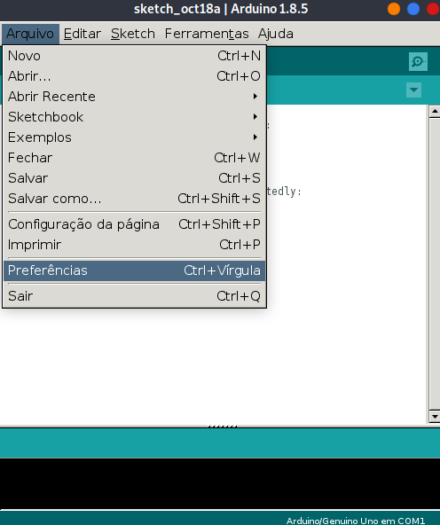
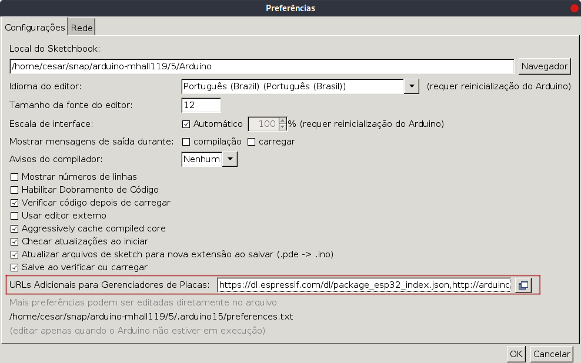
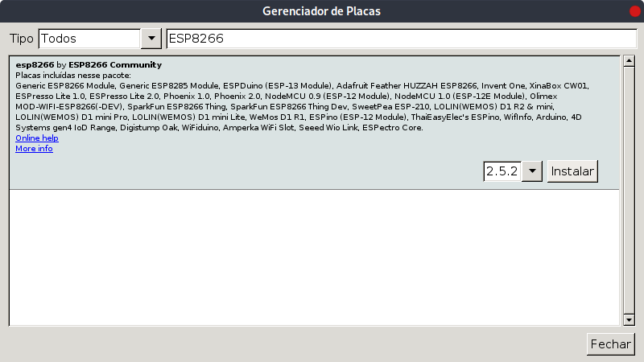
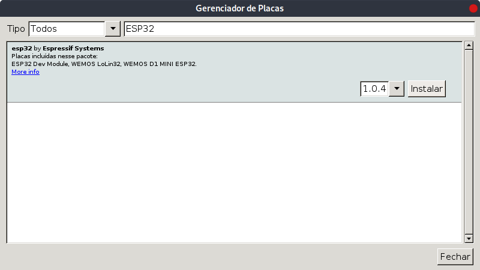
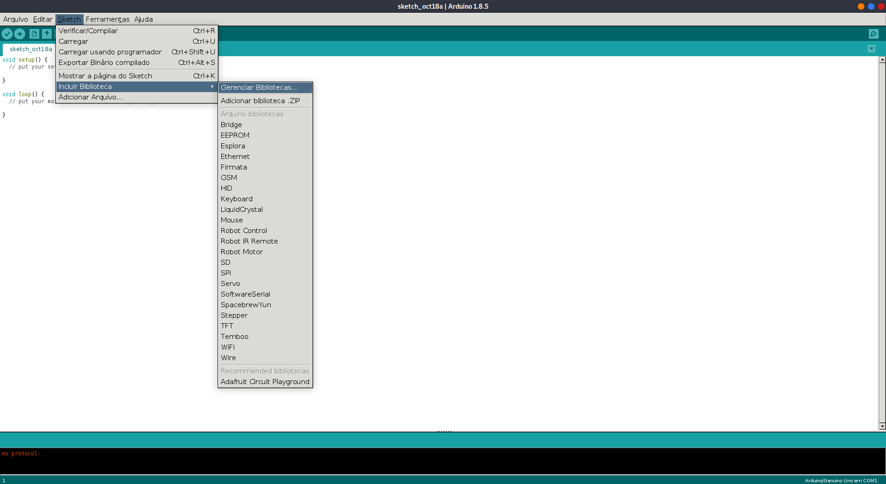
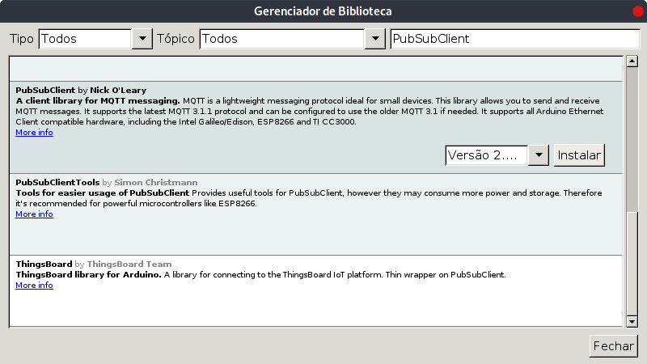
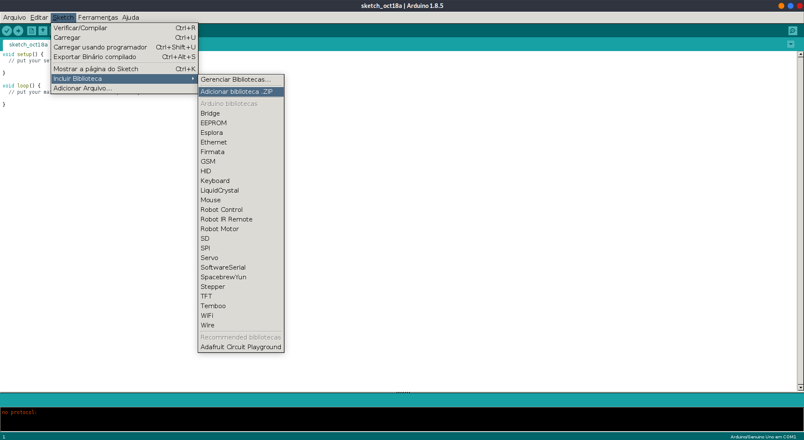

# Preparação do Ambiente:

## Instalação e configuração do Arduino IDE:

1. Faça o download e instalção da aplicação [Arduino IDE](https://www.arduino.cc/en/main/software)
1. Após instalação, abra o aplicativo e vá em: ***Arquivo > Preferências***

1. Configuração para adicionar placas *ESP8266* e *ESP32*:
    1. No campo `URLs Adicionais para Gerenciadores de Placas` adicione as seguintes linhas, separadas por vírgula (`,`):
        > `https://dl.espressif.com/dl/package_esp32_index.json`
        > `http://arduino.esp8266.com/stable/package_esp8266com_index.json`

        
    1. Vá em ***Ferramentas > Placa > Gerenciado de Placas***
    1. Use o campo de busca para achar e instalar os componentes `ESP8266` e `ESP32`
        1. `ESP8266`:
        
        1. `ESP32`:
        

***
## Instalação de Bibliotecas:
Para adicionar uma biblioteca nova siga os passos abaixo:

1. Usando o ***Gerenciador de Bibliotecas***:
    1. Vá em ***Sketch > Incluir Biblioteca > Gerenciar Bibliotecas***
    
    1. Use a busca para localizar e instalar a biblioteca desejada
    

1. Instalando biblioteca baixada (`.zip`):
    1. Vá em ***Sketch > Incluir Biblioteca > Adicionar Biblioteca .ZIP***
    
    2. Procure e selecione o arquivo baixado e clique em `Ok`
